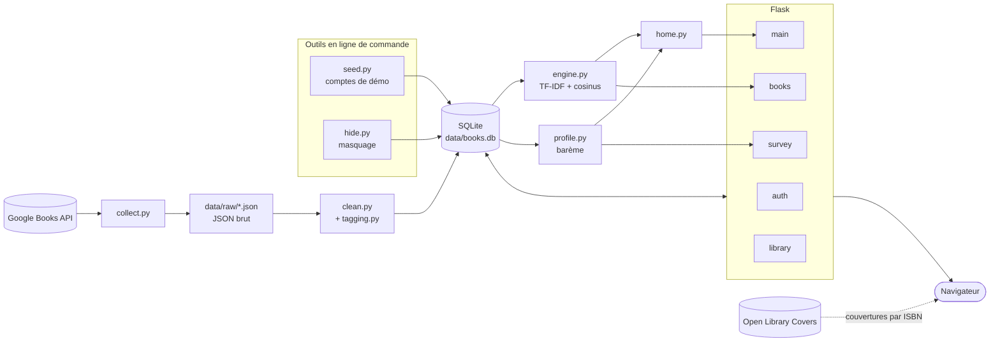
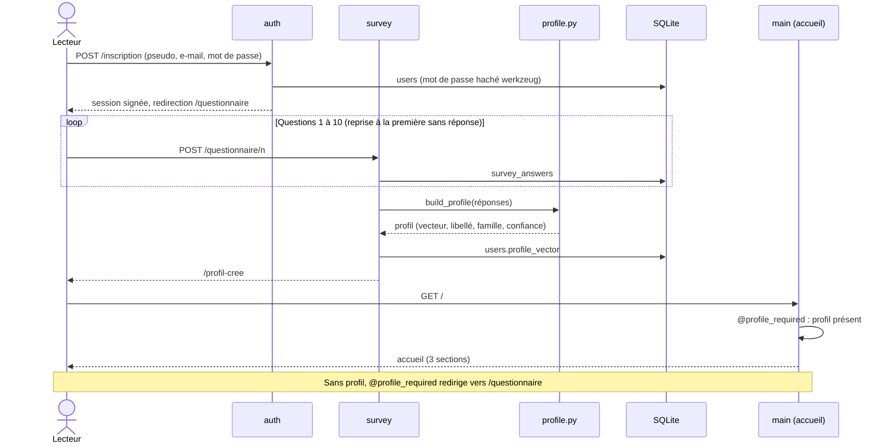

# Architecture technique

Monolithe Python : une chaîne hors ligne construit le catalogue (collecte → nettoyage → SQLite), puis une application Flask sert les pages et calcule les recommandations à la demande. Pas de FastAPI, pas d'embeddings, pas de LLM.

## Vue d'ensemble

- **Hors ligne** : `collect.py` interroge Google Books (49 requêtes, ~11 000 items) et écrit le JSON brut ; `clean.py` filtre, dédoublonne et charge la table `books`, puis `tagging.py` attribue thèmes et ambiance par lexiques de mots-clés.
- **En ligne** : `engine.py` construit l'index TF-IDF (mis en cache dans `data/tfidf.pkl`) pour les livres proches, la recherche et l'indice de nouveauté ; `profile.py` applique le barème du questionnaire (S = 0,84 × P + R + D) ; `home.py` assemble les sections de l'accueil.
- **Couvertures** : l'URL Open Library est placée dans la page ; le navigateur la charge directement (jamais téléchargée par le serveur), avec repli sur la miniature Google puis une carte colorée.

## Séquence du gating

Toute page hors inscription, connexion et questionnaire est protégée par `@profile_required` : tant que le profil n'est pas calculé, le lecteur est renvoyé au questionnaire.

## Modules

Nombre de lignes : `wc -l` (commentaires et docstrings compris).

| Module | Rôle | Lignes |
|---|---|---|
| `src/collect.py` | Collecte Google Books → `data/raw/*.json` | 220 |
| `src/clean.py` | Filtrage (langue, description, pages, non-fiction), dédoublonnage, chargement SQLite | 401 |
| `src/tagging.py` | Thèmes et ambiance par lexiques de mots-clés | 353 |
| `src/stopwords_fr.py` | Mots vides français de l'index TF-IDF | 57 |
| `src/db.py` | Schéma SQLite et requêtes | 498 |
| `src/engine.py` | TF-IDF + cosinus : livres proches, recherche, nouveauté | 435 |
| `src/questions.py` | Les 10 questions, leurs options et leurs poids | 154 |
| `src/profile.py` | Barème, profil lecteur, apprentissage par les notes, diversité | 577 |
| `src/home.py` | Sections de l'accueil, univers, renouveler | 408 |
| `src/stats.py` | Statistiques personnelles | 112 |
| `src/seed.py` | Comptes de démonstration et historiques | 697 |
| `src/hide.py` | Masquage des livres mal classés | 144 |
| `src/suspects.py` | Repérage des livres suspects avant masquage | 52 |
| `src/evaluate.py` | Évaluation du MVP → `docs/evaluation.md` | 419 |
| `app/__init__.py` | `create_app` : configuration, base, blueprints | 37 |
| `app/auth.py` | Inscription, connexion, `@profile_required` | 106 |
| `app/survey.py` | Questionnaire page par page, profil, questionnaire refait | 166 |
| `app/main.py` | Accueil, sélections élargies, explorer | 136 |
| `app/books.py` | Recherche, fiche livre, actions de lecture | 147 |
| `app/library.py` | Bibliothèque, avis, page profil, statistiques | 184 |
| `app/filters.py` | Filtres communs persistés par compte | 147 |
| `run.py` | Lancement local | 8 |
| **Total Python** | | **5 459** |

S'y ajoutent les gabarits Jinja2, le CSS maison et le JS vanilla (1 885 lignes) et 13 fichiers de tests (214 tests).
